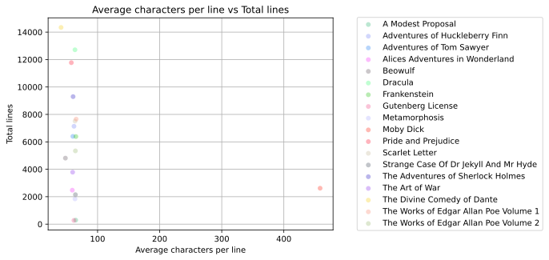
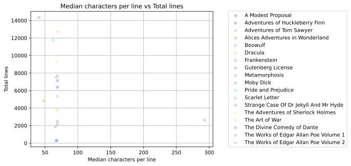
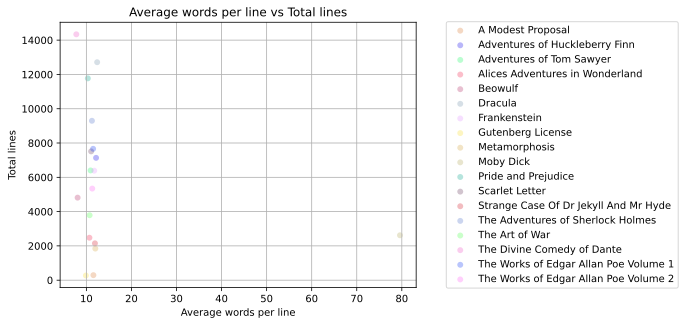
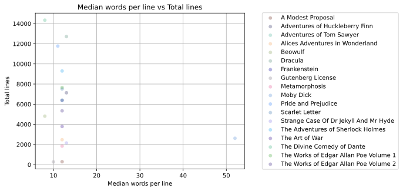

===============
pythonmapreduce
===============

.. image:: https://img.shields.io/travis/allenerocha/pythonmapreduce
    :alt: Travis (.org)
    :target: https://travis-ci.org/allenerocha/pythonmapreduce
.. image:: https://img.shields.io/badge/code%20style-black-000000.svg
    :alt: Code style: black
    :target: https://github.com/psf/black
.. image:: https://codecov.io/gh/allenerocha/pythonmapreduce/branch/master/graph/badge.svg
    :alt: Codecov
    :target: https://codecov.io/gh/allenerocha/pythonmapreduce
.. image:: https://img.shields.io/badge/license-AGPLv3-green
     :alt: License:AGPLv3
    :target: https://www.gnu.org/licenses/agpl-3.0.en.html

Python implementation of the WordCount MapReduce concept using books sourced from https://www.gutenberg.org/

TODO
--------
Features to be implemented:

* Mapping standard input.
* Filtering standard input.
* Reducing the data.
